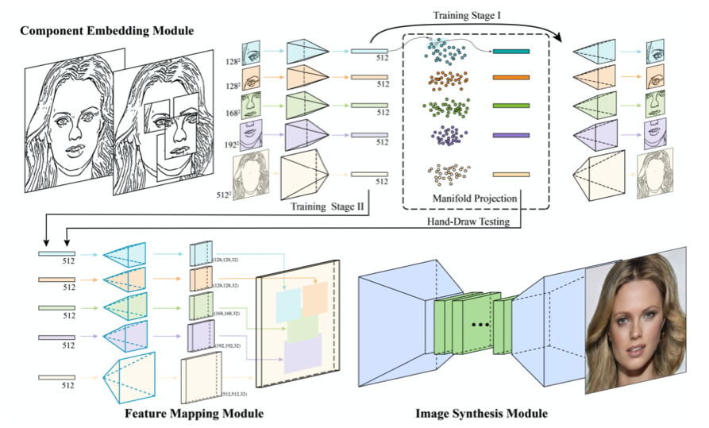
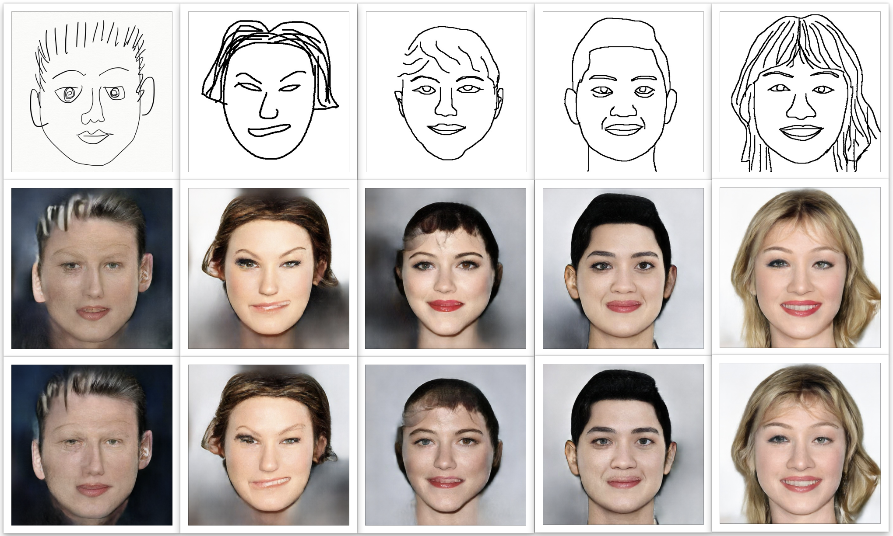
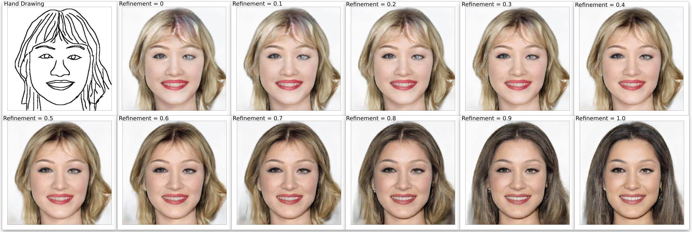

# Drawing-to-Face

***An implementation on the DeepFaceDrawing-Jittor from https://github.com/IGLICT/DeepFaceDrawing-Jittor, which generates face images from freehand sketches using the deep image-to-image translation.***

*(Teaser image from original [REPO](https://github.com/IGLICT/DeepFaceDrawing-Jittor/))*

### Before we start:

#### This REPO mainly helps with creating the working environment easily using docker. If you are just looking for a quick test-drawing with the application, make sure to check out http://www.geometrylearning.com/DeepFaceDrawing/, where the original author created a web-based [testing interface](http://deepfacedrawing.geometrylearning.com/index_EN_621.html/).

### Model Architecture:

*(Illustrate of network architecture from the [paper](http://www.geometrylearning.com/paper/DeepFaceDrawing.pdf))*

As shown in the architecture above, the model is separated into three parts, which are Component Embedding (CE) Module, Feature Mapping (FM) Module and Image Synthesis (IS) Module. An input of hand sketch face image of size 512 by 512, is first decomposed into five components: “left-eye", “right-eye", “nose", “mouth", and “remainder". The "eye"s, "nose" and "mouth" are separated by taking window size of 128, 168 and 192, while the "remainder" is literally the remainder part of the sketch.

#### For the model specifics, please refer to the original paper: 
[Shu-Yu Chen, Wanchao Su, Lin Gao, Shihong Xia, and Hongbo Fu. 2020. DeepFaceDrawing: deep generation of face images from sketches. ACM Trans. Graph. 39, 4, Article 72 (July 2020), 16 pages. DOI:https://doi.org/10.1145/3386569.3392386](http://www.geometrylearning.com/paper/DeepFaceDrawing.pdf)

